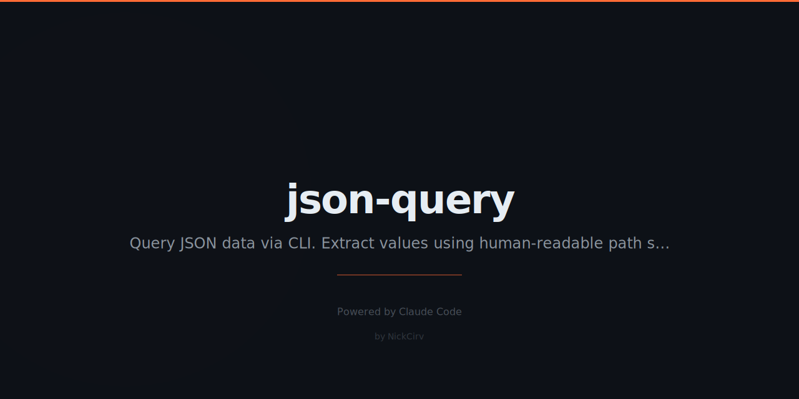

# json-query
> Query JSON with human-readable path syntax. Like jq but actually learnable.

```bash
npx json-query '.users[0].name' data.json
cat api.json | npx json-query '.data[].email'
```

```bash
# Get first user's name
json-query '.users[0].name' data.json  # → "Nick"

# All emails
json-query '.users[].email' data.json  # → ["nick@...", "sarah@..."]

# Filter active users
json-query '.users[? .active == true] | .name' data.json

# Deep search
json-query '..id' nested.json
```

## Path Syntax
| Syntax | Description |
|--------|-------------|
| `.key` | Object property |
| `[0]` / `[-1]` | Index / last |
| `[]` | All array items |
| `..key` | Recursive search |
| `[? .x > 5]` | Filter |
| `\| .field` | Map/pipe |
| `.length` `.keys` `.sort` | Functions |

## Install
```bash
npx json-query '.path' file.json
npm install -g json-query
```

---
**Zero dependencies** · **Node 18+** · Made by [NickCirv](https://github.com/NickCirv) · MIT
